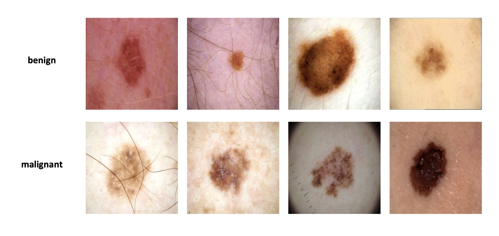

# Skin Cancer Classification Project



## Структура проекта

```bash
.
├── .dvc
│   ├── .gitignore             # Игнорируемые файлы для Git
│   └── config                 # Конфигурация DVC
├── .dvcignore                 # Файл для игнорирования файлов DVC
├── .gitignore                 # Игнорируемые файлы для Git
├── .pre-commit-config.yaml    # Конфигурация для pre-commit хуков
├── Dockerfile                 # Скрипт создания Docker-образа
├── README.md                  # Описание проекта
├── SkinCancerClassification
│   ├── .gitignore             # Игнорируемые файлы для Git
│   ├── __init__.py            # Инициализация пакета
│   ├── infer.py               # Скрипт для инференса
│   ├── model.py               # Определение модели
│   ├── test.py                # Скрипт для тестирования модели
│   ├── train.py               # Скрипт для тренировки модели
│   └── trainer.py             # Логика тренировки модели
├── commands.py                # CLI трейна, теста и инференса
├── configs
│   ├── config.yaml            # Основной файл конфигурации
│   ├── data_loading
│   │   └── data_loading.yaml   # Файл конфигурации загрузки данных
│   ├── infer
│   │   └── infer.yaml         # Файл конфигурации инференса
│   ├── logging
│   │   └── logging.yaml       # Файл конфигурации логирования
│   ├── model
│   │   └── model.yaml         # Файл конфигурации модели
│   ├── testing
│   │   └── testing.yaml       # Файл конфигурации тестирования
│   └── training
│       └── training.yaml      # Файл конфигурации трейна
├── data
│   ├── .gitignore             # Игнорируемые файлы для Git
│   ├── test.dvc               # Файл DVC для тестовых данных
│   ├── train.dvc              # Файл DVC для тренировочных данных
│   └── valid.dvc              # Файл DVC для валидационных данных
├── models                     # Каталог для сохранения моделей
│   ├── .gitignore             # Игнорируемые файлы для Git
├── plots
│   └── resnet18-model-plots.jpg # Графики модели из MLFlow
├── poetry.lock                # Зафиксированные версии зависимостей Poetry
└── pyproject.toml             # Конфигурация проекта для Poetry
```

## Формулировка задачи

**Цель проекта** — применение глубинного обучения для бинарной классификации
изображений кожи. Модель будет определять, является ли кожное поражение
злокачественным или доброкачественным.

В процессе будут использоваться такие MLOps инструменты как **poetry** (для
управления зависимостями), **pre-commit hooks** (для проверки качества кода),
**DVC** (для версионирования данных), **Hydra** (для управления параметрами
конфигурации), **MLFlow** (для логирования метрик и функции потерь).

## Данные

Данные c Kaggle:
[Skin cancer classification for YOLOv8](https://www.kaggle.com/datasets/cubeai/skin-cancer-classification-for-yolov8)

Датасет состоит из 13880 изображений кожных поражений, классифицированных в два
класса: **Malignant (злокачественным)** и **Benign (доброкачественным)**

Датасет сбалансирован по классам и разбит на три части: Train, Validation, Test.
Изображения помимо кожных поражений могут содержать посторонние элементы
(например, волосы).

## Подход к моделированию

### Модель

Для решения задачи используется сверточная нейронная сеть ResNet-18,
предобученная на большом датасете ImageNet. Последний полносвязный слой модели
заменен на новый для бинарной классификации. Для эффективного обучения
заморожены все слои, кроме последнего, что позволяет дообучить модель с
минимальными вычислительными затратами.

Основной фреймворк: `torch`, `torchvision`, `pytorch-lightning`.

Оптимизатор: `AdamW`.

Функция потерь: `CrossEntropyLoss`.

Метрики: `accuracy`.

### Управление зависимостями

Для управления зависимостями используется **Poetry**.

### Data Version Control

Применяется DVC (Data Version Control) для версионирования и хранения датасета.

### Hydra

Для удобства настройки параметров (`batch_size`, `lr`, `num_workers` и
`num_epochs` и др.) используется **Hydra**. Конфигурации вынесены в отдельные
YAML-файлы, расположенные в папке `configs/`.

### Логирование

В проекте используется **MLflow** для логирования лоссов и метрик, сохранения
моделей и артефактов.

## Способ предсказания

В корне репозитория расположен файл `commands.py`, который позволяет управлять
основными процессами проекта (тренировка, тестирование, инференс) через
командную строку с использованием CLI аргументов.

#### Обучение

Для запуска обучения модели с параметрами из конфига:

```bash
python commands.py train
```

Для запуска обучения модели с передачей параметров:

```bash
python commands.py train training.lr=0.001 training.batch_size=32
```

#### Тестирование

Для оценки модели на тестовом наборе данных с моделью из конфига :

```bash
python commands.py test
```

#### Инференс

Для запуска инференса для изображения нужно передать его имя как аргумент:

```bash
python commands.py infer infer.image_name="xenahkar/photo-for-skin-classification.jpg"
```

Пример результата:

```json
{ "Skin Cancer Prediction": "benign", "Confidence": "99.64 %" }
```

## Развитие проекта

В дальнейшем планируется реализовать **FastAPI** сервис, который будет принимать
изображение, предобрабатывать его, классифицировать с помощью обученной модели и
возвращать предсказание о типе кожного поражения (доброкачественное или
злокачественное). Также такой сервис можно будет интегрировать в различные
приложения, например, в **Telegram-бот**.
